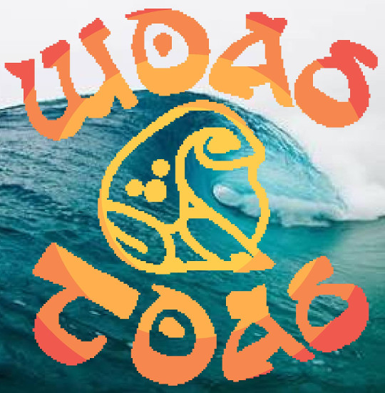

# Woad Toad™ Surfware™
A games developments frameworks for Lua.

[](https://woadtoad.herokuapp.com/)

## Install

You'll want to run the following steps, because some of the libs are submodules.

```shell
git clone https://github.com/woadtoad/love-boilerplate.git
cd love-boilerplate
git submodule update --init
```

## Structure

### Globals vs Modules
Modules over globals. Globals are generally a bad idea, so try your best to avoid them.

### Directories

```
assets/
```
In the `assets/` are generated sprite sheets and lua factories that come from TexturePacker.

```
libs/
```
In the `libs/` are thirdparty libraries, which aren't (yet) modified. A special case is TexMate, which is a git submodule. See Install for details.

```
src/
```
In `src/` are our .lua source files for the game. Add wonderful codes here.

```
src/SCENES.lua
src/scenes
```
Scenes in the game are added and maintained in this file and directory.

## Libraries

### [LÖVE](LOVE)

### [anim8](https://github.com/kikito/anim8)
Animation library for [LÖVE](LOVE).

In order to build animations more easily, anim8 divides the process in two steps: first you create a _grid_, which is capable of creating _frames_ (Quads) easily and quickly. Then you use the grid to create one or more _animations_.

### [Hardon Collider](https://vrld.github.io/HardonCollider/)
HardonCollider is a Lua module to simplify one important aspect in computer games: Collision detection.

It can detect collisions between arbitrary positioned and rotated shapes. Those shapes can either be circles or polygons. Any non-intersecting polygons are supported, even concave ones.

The main interface is simple:

- Define collision callbacks,
- Add shapes to the scene and
- Update HardonCollider every frame.

### [hump](https://vrld.github.io/hump/)
**H**elper **U**tilities for a **M**ultitude of **P**roblems is a set of lightweight helpers for the awesome LÖVE Engine. hump differs from other libraries in that every component is independent of the remaining ones.

_Note. we're using the following modules:_

* **hump.timer**  
Delayed and time-limited function calls, and tweening support.
* **hump.vector**  
2D vector math.
* **hump.camera**  
A camera for LÖVE.

_But the following are also included:_

* hump.gamestate  
A gamestate system.
* hump.vector-light  
Lightweight 2D vector math.
* hump.class  
Object oriented programming for Lua.
* hump.signal  
Simple Signal/Slot (aka. Observer) implementation.

### [hxdx](https://github.com/adonaac/hxdx)
**hxdx** is a physics module for LÖVE. It wraps LÖVE's physics API so that using box2d becomes as simple as possible.

### [Jumper](https://github.com/Yonaba/Jumper)
__Jumper__ is a pathfinding library designed for grid-based games. It aims to be __fast__ and __lightweight__.

It features a wide range of search algorithms, built within a clean interface with chaining features which makes it __very friendly and easy to use__.

### [middleclass](https://github.com/kikito/middleclass)
A simple OOP library for Lua. It has inheritance, metamethods (operators), class variables and weak mixin support.

### [Simple Tiled Implementation](https://github.com/karai17/Simple-Tiled-Implementation)
Simple Tiled Implementation is a [**Tiled Map Editor**][Tiled] library designed for the *awesome* [**LÖVE**][LOVE] framework. Please read the library [**documentation**][sti-docs] to learn how it all works!

### [Stateful](https://github.com/kikito/stateful.lua)
Lua implementation of [State pattern](https://en.wikipedia.org/wiki/State_pattern) for Classes. Allows Class instance methods to be overloaded by particular a state (context).

### [TESound](https://love2d.org/wiki/TEsound)
Sound manager for the Love2D framework. TEsound is intended to make it easier to use sounds and music in your games.

### [TexMate (& AtlasImporter)](TexMate)
[Texture Packer](https://www.codeandweb.com/texturepacker) and [ShoeBox](http://renderhjs.net/shoebox/) importer and animation helper library for LÖVE.

### [Thranduil](https://github.com/adonaac/thranduil)
A UI module for LÖVE. Facilitates the creation of game specific UI through UI elements that have all their logic abstracted away. Each element is simple enough and exposes as much of its state as possible, meaning you can use this state to draw the element in whatever way you want or to build new UI elements with it (say you wanna make a menu, you can do it with a bunch of Buttons and a Frame).

## Credits
[Muzz](https://github.com/Muzz) curated this fine assortment of fashionable Lua libraries.

[Tiled]: http://www.mapeditor.org/
[LOVE]: https://www.love2d.org/
[sti-docs]: http://karai17.github.io/Simple-Tiled-Implementation/
[TexMate]: https://github.com/Muzz/TexMate
